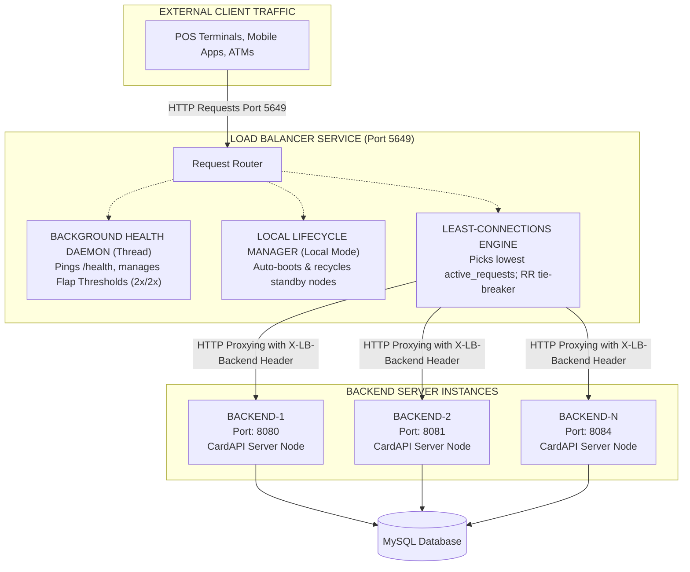
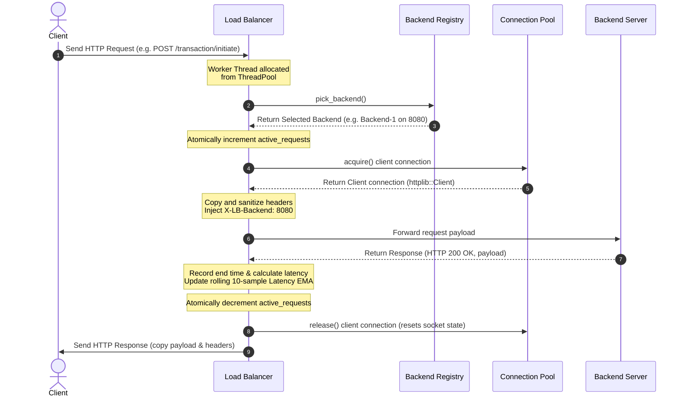
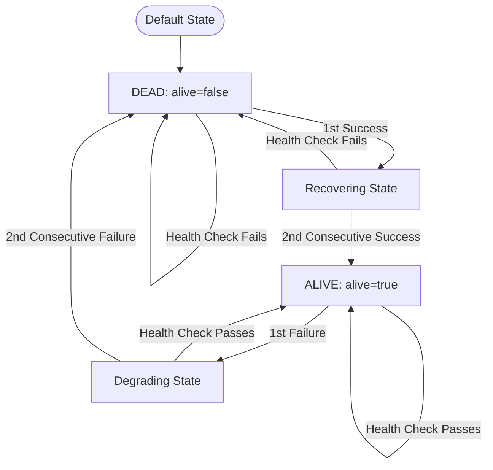
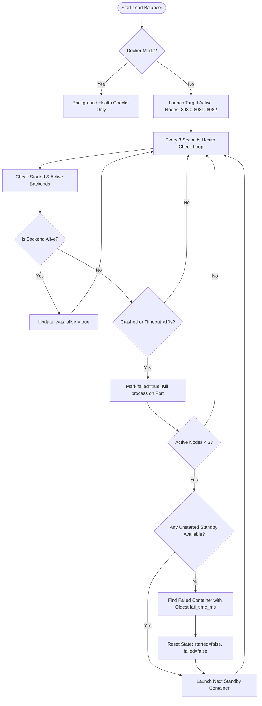

# 🚀 High-Performance C++20 Reverse Proxy Load Balancer

[](https://en.cppreference.com/w/cpp/compiler_support/20)
[](https://cmake.org)
[](https://www.apple.com/macos/)
[](https://www.docker.com/)
[](LICENSE)

An industrial-grade, multithreaded **C++20 Reverse Proxy Load Balancer** specifically designed to scale high-concurrency payment switching engines (such as `CardAPIServer`). Operating at the public entry point, it intercepts HTTP traffic and distributes transaction requests across backend server instances. 

It features a thread-safe, lock-free **Least-Connections** scheduling algorithm with a high-performance **Round-Robin** fallback tie-breaker, a background health monitor with **Flap Prevention**, a local **Hot-Standby Failover Lifecycle Manager**, and administrative metrics endpoints.

---

## 📖 Table of Contents
1. [System Architecture & Traffic Flow](#-system-architecture--traffic-flow)
   * [High-Level System Block Diagram](#high-level-system-block-diagram)
   * [End-to-End Request Sequence Flow](#end-to-end-request-sequence-flow)
2. [Internal Mechanics & Functionality](#-internal-mechanics--functionality)
   * [1. Thread-Safe, Lock-Free Backend Registry](#1-thread-safe-lock-free-backend-registry)
   * [2. High-Performance Connection Pool](#2-high-performance-connection-pool)
   * [3. Least-Connections Routing & Tie-Breaker](#3-least-connections-routing--tie-breaker)
   * [4. Wildcard Request Proxying & Body Buffering](#4-wildcard-request-proxying--body-buffering)
   * [5. Daemon Health Checker & Flap Prevention](#5-daemon-health-checker--flap-prevention)
   * [6. Local Container Lifecycle & Failover Manager](#6-local-container-lifecycle--failover-manager)
   * [7. Graceful Shutdown & Cleanup Sequence](#7-graceful-shutdown--cleanup-sequence)
3. [Configuration & Environment Variables](#-configuration--environment-variables)
4. [Setting Up & Running Locally](#-setting-up--running-locally)
   * [Build Requirements](#build-requirements)
   * [Building via CLI (CMake & Ninja)](#building-via-cli-cmake--ninja)
   * [Running in CLion IDE](#running-in-clion-ide)
5. [Docker Orchestrated Setup](#-docker-orchestrated-setup-5-backends--db--lb)
   * [Directory Layout](#directory-layout)
   * [Database Capacity Configuration (Crucial)](#database-capacity-configuration-crucial)
   * [Starting the Docker Stack](#starting-the-docker-stack)
6. [Monitoring & Administrative APIs](#-monitoring--administrative-apis)
   * [`GET /lb/health`](#get-lbhealth)
   * [`GET /lb/status` (Metrics Console)](#get-lbstatus-metrics-console)
7. [Load Simulation & Benchmarking](#-load-simulation--benchmarking)
8. [Troubleshooting Guide](#-troubleshooting-guide)
9. [Developer Contact Info](#-developer-contact-info)

---

## 🏗️ System Architecture & Traffic Flow

### High-Level System Block Diagram
The load balancer sits on external ports, intercepting incoming HTTP transactions and proxying them to isolated backend microservices, which share a database.



### End-to-End Request Sequence Flow
The following sequence diagram describes the path of an incoming API request through the proxy:



---

## ⚙️ Internal Mechanics & Functionality

### 1. Thread-Safe, Lock-Free Backend Registry
At the core of the routing architecture is the `Backend` registry. Since multiple HTTP worker threads process requests concurrently while the background health daemon updates node statuses, standard data structures would suffer from race conditions or lock contention.

To prevent this, status variables use C++ standard atomics (`std::atomic`). This permits simultaneous read and write operations on backend parameters without requiring heavy operating system mutexes.

```cpp
struct Backend {
  std::string host;
  int port;
  std::string endpoint_str; // Cached "host:port"

  std::atomic<bool> alive{false};
  std::atomic<bool> started{false};
  std::atomic<bool> failed{false};
  std::atomic<bool> was_alive{false};
  std::atomic<long long> launch_time_ms{0};
  std::atomic<long long> fail_time_ms{0};
  std::atomic<int> active_requests{0}; // Signed to prevent silent underflows
  std::atomic<int> consecutive_failures{0};
  std::atomic<int> consecutive_successes{0};
  std::atomic<long long> avg_response_ms{0}; // Rolling average latency
  std::atomic<int> restart_attempts{0};

  std::shared_ptr<ConnectionPool> pool;

  const std::string &endpoint() const { return endpoint_str; }
};
```

> [!NOTE]
> Registry nodes are kept inside a `std::vector<std::unique_ptr<Backend>>`. Using smart pointers (`unique_ptr`) prevents vector reallocations from invoking copy or move constructors on non-copyable `std::atomic` variables.

---

### 2. High-Performance Connection Pool
Instead of opening and closing TCP sockets for every request, the Load Balancer maintains a bounded, thread-safe `ConnectionPool` for each backend using Keep-Alive connections.

```cpp
class ConnectionPool {
private:
  std::string host_;
  int port_;
  std::mutex mutex_;
  std::vector<httplib::Client *> clients_;
  size_t max_size_;
  // ...
public:
  std::unique_ptr<httplib::Client> acquire();
  void release(std::unique_ptr<httplib::Client> cli);
};
```

#### Core Pool Optimizations:
* **Stale Socket Flushing**: When releasing a connection back to the pool, the load balancer calls `cli->stop()`. This flushes the socket descriptors, forcing `cpp-httplib` to negotiate a fresh TCP connection on the next request, preventing `ECONNRESET` or silent request drops.
* **Destructor Thread Safety**: The pool destructor acquires a lock before deleting clients to avoid data races with thread releases during shutdown.

---

### 3. Least-Connections Routing & Tie-Breaker
When a request is intercepted, `pick_backend()` scans the backend registry to identify the server handling the lowest load:

```cpp
static Backend *pick_backend() {
  static constexpr size_t kMaxCandidates = 64;
  Backend *candidates[kMaxCandidates];
  size_t candidate_count = 0;
  int min_conn = std::numeric_limits<int>::max();

  const size_t n = g_backends.size();
  for (size_t i = 0; i < n; ++i) {
    Backend *b = g_backends[i].get();
    if (!b->alive.load(std::memory_order_relaxed))
      continue;
    
    int active = b->active_requests.load(std::memory_order_relaxed);
    if (active < min_conn) {
      min_conn = active;
      candidates[0] = b;
      candidate_count = 1;
    } else if (active == min_conn && candidate_count < kMaxCandidates) {
      candidates[candidate_count++] = b;
    }
  }

  if (candidate_count == 0) return nullptr;
  if (candidate_count == 1) return candidates[0];

  // Tie-breaker: Round-Robin selection
  static std::atomic<size_t> rr_index{0};
  size_t index = rr_index.fetch_add(1, std::memory_order_relaxed);
  return candidates[index % candidate_count];
}
```

#### Selection Flow:
1. **Liveness Filter**: Only nodes where `alive == true` are evaluated.
2. **Load Evaluation**: The engine locates the minimum `active_requests` counter.
3. **Array Caching**: Candidate servers tied for the minimum load are stored in a fixed-size stack array (no dynamic allocations).
4. **Round-Robin Tie-Breaker**: If multiple servers are tied, a thread-safe, lock-free global counter (`rr_index`) selects the candidate on a round-robin basis using relaxed memory ordering.

---

### 4. Wildcard Request Proxying & Body Buffering
Standard reverse proxies that hook into pre-routing handlers run *before* reading the request body, leaving `req.body` unpopulated and causing POST requests to fail with body verification errors.

To solve this, this proxy registers explicit HTTP wildcard methods:

```cpp
proxy_svr.Get(R"(.*)", proxy_handler);
proxy_svr.Post(R"(.*)", proxy_handler);
proxy_svr.Put(R"(.*)", proxy_handler);
proxy_svr.Delete(R"(.*)", proxy_handler);
proxy_svr.Patch(R"(.*)", proxy_handler);
proxy_svr.Options(R"(.*)", proxy_handler);
```

#### Handling Steps:
* **Full Buffering**: The proxy waits for the client request to be fully loaded into memory before starting the forwarding handler.
* **Header Sanitization**: Hop-by-hop headers (`Host`, `Content-Length`, `Transfer-Encoding`, `Connection`) are filtered out and recomputed dynamically before forwarding to prevent backend communication mismatches.
* **Backend Ingress Tracing**: An tracking header `X-LB-Backend: <port>` is injected, simplifying transaction tracing across microservices.
* **Latency Tracking**: Response times are measured with `std::chrono::steady_clock` and recorded as a 10-sample **Exponential Moving Average (EMA)** to provide a rolling representation of performance:
  $$\text{EMA}_{\text{new}} = \frac{(\text{EMA}_{\text{old}} \times 9) + \text{Latency}}{10}$$

---

### 5. Daemon Health Checker & Flap Prevention
A dedicated background thread runs continuously to verify backend availability and prevent flapping (repeatedly marking a server alive and dead due to intermittent network glitches).



#### Mechanics:
* **Active Probe**: Every 3 seconds, the thread pings `/health` on all registered servers.
* **State Parsing**: It accepts HTTP 200 OK and validates the status JSON body containing `"status": "UP"`.
* **Lock-Free State Updates**: Transitions use atomic `compare_exchange_strong` to prevent collisions:
  - **Failures to Dead**: Needs **2 consecutive failed checks** before marking the node dead and removing it from rotation.
  - **Recovery to Alive**: Needs **2 consecutive successful checks** before restoring the node to the active routing pool.

---

### 6. Local Container Lifecycle & Failover Manager
When running in **Local Mode** (outside Docker), the Load Balancer acts as an active supervisor for the backend processes on your machine.



#### Key Capabilities:
* **Background Startup**: Backends are launched as detached background processes using `std::system`. Output is redirected to individual log files (`CONTAINER/container_<port>.log`) for debugging.
* **C++20 Double-Start Guard**: Uses `compare_exchange_strong` on the `started` atomic flag to prevent threads from double-booting the same process.
* **Hot-Standby Failover**: The lifecycle manager targets keeping exactly 3 containers active. If one crashes, it immediately spawns a standby container (e.g. ports `8083` or `8084`).
* **Dynamic Recycling Strategy**: If all standby containers are exhausted and fail, the manager sorts the failed nodes by `fail_time_ms`. It resets and restarts the node that went down **longest ago** to allow for maximum cooldown time.

---

### 7. Graceful Shutdown & Cleanup Sequence
To prevent zombie processes and port conflicts, the load balancer implements clean termination handling:

1. **Signal Interception**: Captures `SIGINT` (Ctrl+C), `SIGTERM`, `SIGHUP`, and `SIGQUIT` via signal handlers.
2. **Listener Shutdown**: Safely signals the HTTP servers (`proxy_svr` and `admin_svr`) to stop listening for new traffic using atomic server pointers.
3. **Thread Joining**: Joins the background health daemon thread and the admin server thread.
4. **Local Process Cleanup**: A thread-safe `std::once_flag` block executes a clean-up routine that sweeps the active ports, resolves running PIDs, and kills the backend binaries (`kill -9`).

---

## 📋 Configuration & Environment Variables

The Load Balancer behaves dynamically based on the following environment variables:

| Environment Variable | Type | Default Value | Description |
| :--- | :--- | :--- | :--- |
| `LB_PORT` | Integer | `5649` | Port where the proxy server listens for client requests. |
| `LB_ADMIN_PORT` | Integer | `5650` | Port where the administrative metrics console listens. |
| `BACKENDS` | String | *None* | Comma-separated `"host:port"` strings. **Setting this enables Docker Mode** (disables process spawning). |
| `BACKEND_HOST` | String | `127.0.0.1` | Target IP address for local backend nodes. |
| `BACKEND_PORTS` | String | `8080,8081,8082,8083,8084` | Comma-separated list of ports for local backends. |
| `TARGET_ACTIVE_BACKENDS` | Integer | `3` | Number of local container processes to maintain active in Local Mode. |
| `STARTUP_TIMEOUT` | Integer | `10` | Seconds to wait for a local container to boot and pass health checks. |
| `MAX_RESTART_ATTEMPTS` | Integer | `3` | Maximum restart attempts allowed for a single container port. |
| `HEALTH_CHECK_INTERVAL` | Integer | `3` | Delay (in seconds) between backend health probes (Clamped 1–60s). |

---

## 🖥️ Setting Up & Running Locally

### Build Requirements
To compile the project natively:
* **Compiler**: Supporting **C++20** (GCC 10+, Clang 12+, Xcode 13+)
* **Build System**: **CMake** (v3.15 or higher) and **Ninja**
* **Library**: POSIX `pthreads` runtime support

### Building via CLI (CMake & Ninja)
Run the following commands in the workspace root:

```bash
# Generate Ninja build artifacts in debug configuration
cmake -S . -B build -G Ninja -DCMAKE_BUILD_TYPE=Debug

# Compile the target binary
cmake --build build

# Run the executable
./build/LOADbalancer
```

### Running in CLion IDE
1. Open CLion and choose **Open**.
2. Select the directory `/Users/rohansakhare/LOADbalancer`.
3. Go to **Run/Debug Configurations** (`Run > Edit Configurations`).
4. Select the `LOADbalancer` target.
5. In the **Environment Variables** field, add your configuration:
   ```env
   LB_PORT=5649;LB_ADMIN_PORT=5650;BACKEND_PORTS=8080,8081,8082,8083,8084;TARGET_ACTIVE_BACKENDS=3;STARTUP_TIMEOUT=10
   ```
6. Press the green **Run** button.

---

## 🐳 Docker Orchestrated Setup (5 Backends + DB + LB)

Running multiple servers locally on a host system can lead to dependency conflicts, local port clashes, and database link shortages. Running inside Docker Compose isolates these servers.

### Directory Layout
For the multi-container configuration to build correctly, verify your folders are arranged as follows:
```
├── CardAPIServer/        # Payment switching engine source files
└── LOADbalancer/         # Load balancer directory containing docker-compose.yml
```

### Database Capacity Configuration (Crucial)
Each of the 5 C++ backend containers spins up an internal database connection pool of **30 sessions** (`POOL_SIZE = 30`).
* $$5 \text{ backends} \times 30 \text{ connections} = 150 \text{ concurrent connections}$$
* MySQL's default ceiling is **151** (`max_connections`).
* If you run any other database tool (like CLion Database Inspector or MySQL Workbench), the connection limit is reached. The 4th and 5th backend containers will fail to connect at startup.

#### **Solution**:
Increase MySQL's connection limit by running this query on your MySQL server:
```sql
SET GLOBAL max_connections = 250;
```

### Starting the Docker Stack
Run the commands from the `LOADbalancer/` directory:

```bash
# Build and run the environment in detached mode
docker compose up --build -d

# Verify that all 7 containers are healthy
docker compose ps
```

The startup order is:
1. `mysql-db` boots and waits for its root health check to pass.
2. `card-backend-1` to `5` boot and wait for `/health` to respond.
3. `card-lb` compiles, starts on port `5649`, and begins routing.

---

## 📊 Monitoring & Administrative APIs

The Load Balancer hosts an independent administrative server on port `5650`.

### GET `/lb/health`
Verifies if the Load Balancer proxy is up.

* **Request**: `http://localhost:5650/lb/health`
* **Response Status**: `200 OK`
* **Response Body**:
  ```json
  {
     "status": "UP"
  }
  ```

---

### GET `/lb/status` (Metrics Console)
Exposes the real-time operational status, statistics, latency (EMA), active requests, and uptime for every backend in the pool.

* **Request**: `http://localhost:5650/lb/status`
* **Response Status**: `200 OK`
* **Response Body**:
```json
{
    "lb_status": "UP",
    "total_backends": 5,
    "alive_backends": 5,
    "total_requests_forwarded": 274,
    "uptime_seconds": 124,
    "backends": [
        {
            "host": "127.0.0.1",
            "port": 8080,
            "alive": true,
            "active_requests": 0,
            "avg_response_ms": 14,
            "consecutive_failures": 0,
            "consecutive_successes": 42
        },
        {
            "host": "127.0.0.1",
            "port": 8081,
            "alive": true,
            "active_requests": 0,
            "avg_response_ms": 28,
            "consecutive_failures": 0,
            "consecutive_successes": 42
        },
        {
            "host": "127.0.0.1",
            "port": 8082,
            "alive": true,
            "active_requests": 0,
            "avg_response_ms": 19,
            "consecutive_failures": 0,
            "consecutive_successes": 42
        },
        {
            "host": "127.0.0.1",
            "port": 8083,
            "alive": true,
            "active_requests": 0,
            "avg_response_ms": 22,
            "consecutive_failures": 0,
            "consecutive_successes": 42
        },
        {
            "host": "127.0.0.1",
            "port": 8084,
            "alive": true,
            "active_requests": 0,
            "avg_response_ms": 15,
            "consecutive_failures": 0,
            "consecutive_successes": 42
        }
    ]
}
```

---

## ⚡ Load Simulation & Benchmarking

You can verify that the load balancer correctly distributes requests across backends by running concurrent transactions.

To simulate transaction traffic under load using **ApacheBench (`ab`)**:

```bash
ab -n 1000 -c 10 -p transaction.json -T application/json http://localhost:5649/transaction/initiate
```
*(Where `transaction.json` contains a valid payment payload).*

Querying `/lb/status` while the benchmark is running will show `active_requests` fluctuating across different ports, and the `total_requests_forwarded` increasing across all backends.

---

## 🔧 Troubleshooting Guide

#### 1. Why does my POST request return `400 Bad Request` with an `"Empty request body"` error?
> [!WARNING]
> This occurs if the load balancer intercepts requests inside `set_pre_routing_handler`. In `cpp-httplib`, the pre-routing handler runs *before* the server parses the HTTP body, meaning `req.body` is empty.
> 
> **Fix**: Ensure your Load Balancer routes requests using explicit method handlers (e.g. `proxy_svr.Post(R"(.*)", ...)`) which run *after* the body has been fully buffered in memory.

#### 2. Why does Postman show a blank body but HTTP status `200 OK`?
> [!IMPORTANT]
> This happens when copying the backend response body to the frontend response (`res.body = result->body`) without calling `res.set_content()`. Without a matching `Content-Type` header, clients (like Postman or web browsers) don't know how to render the response.
> 
> **Fix**: Always set the body and Content-Type together:
> ```cpp
> res.set_content(result->body, "application/json");
> ```

#### 3. Why is there a 10-second delay when sending requests at startup?
> [!CAUTION]
> If backends default to `alive = true` before their health is verified, the Load Balancer may attempt to route traffic to offline servers. If a server is offline, the proxy client hits a connection timeout (5 seconds per attempt) before failing over to the next host, causing a noticeable delay.
> 
> **Fix**: Configure backends to start as `alive = false`. This ensures that they only receive traffic *after* passing 2 consecutive background health checks.

#### 4. Why are the 4th and 5th backend containers crashing in Docker Compose?
> [!IMPORTANT]
> This occurs when the total number of database sessions opened by the active backends exceeds the database server capacity threshold. 
> 
> **Fix**: Execute `SET GLOBAL max_connections = 250;` on the MySQL database instance to resolve connection exhaustion.

---

## 👥 Developer Contact Info

* **Name**: Rohan Sakhare
* **Email**: [rohanavinashsakhare@gmail.com](mailto:rohanavinashsakhare@gmail.com)
* **Phone**: +91 9112765649
* **GitHub**: [@rohsak5649](https://github.com/rohsak5649)
